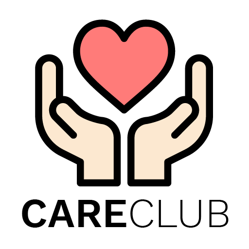

<div align="center">
  
</div>

<br>
<p align="center">
A secure and transparent platform for your donations🤝
</p>
<p align="center">
crafted with <span style="color: #ce2029;">&hearts;</span> by team Alpha Debuggers for BitBox Solution Challenge.
</p>
<p align="center">
    
    
    
</p>

> Happiness doesn't result from what we get, but from what we give. To care is to share. 🤗
 

## Preview 📺

<div align="center">
  
   
     
     
     
      
      
      
     
     
    
</div>


## Installation 🔨

You can download the repository using Git Bash or Browser 🌎.
 Git bash command for downloading the repository:
```console
git clone https://github.com/shubhangi-singh21/CareClub.git
```

## Key Features 🔍

- [x] A secure and transparent donation app
- [x] Aligns with the 17 UN Sustainable Development Goals
- [x] Contactless pickup service from your doorstep
- [x] Track your donations at any point of process
- [x] Photo verification when your donation reaches the needy
- [x] Promotes donations in all forms, monetary and non-monetary
- [x] Razorpay payment gateway for secure transactions
- [x] In-app store to promote the use of eco-friendly goods
- [x] Spreads awareness for the importance of hygiene
- [ ] Availale on Google Play Store & App Store

## License 📜

`CareClub` is available under the MIT license. 


## Shout outs 💥

| <p align="center"><br>[Shubham Mehta](https://github.com/shubham64mehta)</p> | <p align="center"><br>[Shanu Mishra](https://github.com/Shanu1515)</p> | <p align="center"><br>[Shubhangi Singh](https://github.com/shubhangi-singh21)</p> | <p align="center"><br>[Ayush Choudhary](https://github.com/ac14choudhary)</p> |
| ---------------------------------------------------------------------------------------------------------------------------------- | -------------------------------------------------------------------------------------------------------------------------------------------------- | -------------------------------------------------------------------------------------------------------------------------------------------------- | -------------------------------------------------------------------------------------------------------------------------------------------------- |


